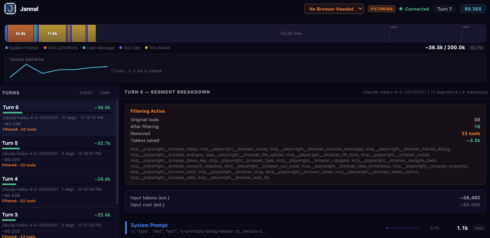

# Jannal

**See what's eating your context window. Then fix it.**

Jannal sits between your AI tools and the Anthropic API. It intercepts every request, visualizes how your context window is being used, and lets you filter out tools you don't need — saving tokens and money.

Works with Claude Code and any tool that speaks the Anthropic Messages API. [Cursor support is pending](#cursor-support).




## What it does

**Inspect** — Watch every API request in real time. See exactly how many tokens go to the system prompt, tool definitions, conversation history, and tool results. The context bar shows you at a glance where your tokens are going.

**Cost tracking** — See the cost of every turn, with per-model pricing (Opus, Sonnet, Haiku). Session cost accumulates in the header so you always know what you're spending. Uses the official `count_tokens` API for accurate counts before the response even finishes.

**Filter tools** — The killer feature. If you're running Claude Code with 40+ MCP tools defined, half of them are probably irrelevant to what you're doing right now. Jannal strips them from the request before it hits the API. Create named profiles ("Coding Only", "Browser Automation") and switch between them from the UI.

## Quick start

```bash
npx @buzzie-ai/jannal
```

Or install and run manually:

```bash
git clone https://github.com/Buzzie-AI/jannal.git
cd jannal
npm install
npm run build
npm start
```

Then start your AI tool pointing at the proxy:

```bash
# Claude Code
ANTHROPIC_BASE_URL=http://localhost:4455 claude

# Or any tool that supports ANTHROPIC_BASE_URL
ANTHROPIC_BASE_URL=http://localhost:4455 your-tool
```

Open `http://localhost:4455` in your browser to see the Inspector.

## How it works

```
Your AI Tool  →  Jannal (localhost:4455)  →  api.anthropic.com
                      ↓
              Inspector UI (browser)
```

The proxy is transparent. It forwards requests to Anthropic and pipes responses back. The only modification it makes is tool filtering when you have an active profile.

Your API key passes through the proxy in the request headers — it's never stored or logged. The proxy runs entirely on your machine.

## Features

### Context bar
A visual breakdown of every segment in the context window. System prompt, tools, messages, tool results — each gets a colored block proportional to its token count. Pressure indicators glow when you're approaching the context limit.

### Turn timeline
Every API request appears as a turn in the left panel. Click one to see its full segment breakdown. Tokens, costs, and model info at a glance.

### Full content modal
Click any segment to see its complete content — system prompts, tool definitions with full JSON schemas, message text. Search, copy, and switch between formatted and raw views.

### Tool filtering profiles
Open the Tools segment, uncheck the tools you don't need, save as a named profile. Profiles persist across restarts (stored in `profiles.json`). Switch profiles from the header dropdown. An orange "FILTERING" badge reminds you when filtering is active.

**Tool grouping by MCP server** — Tools are grouped by inferred MCP server (e.g. `github`, `filesystem`). Enable or disable an entire server at once with per-group All/None buttons.

### Accurate token counting
Three phases: instant char-based estimates, then exact counts via the `count_tokens` API (free, fires in parallel), then ground truth from the response. Per-segment breakdowns are proportionally scaled when exact totals arrive.

### Cost per turn
Pricing for all Claude models, updated to current rates. See input cost, output cost, and total per turn. Session cost accumulates in the header.

### Session export & persistence
Export your session as **JSON** or **CSV** for analysis. Session data (turns, costs, segments) persists across page refreshes via `localStorage` — pick up where you left off.

### Token growth chart
A sparkline below the context bar shows input tokens per turn over time. Spot conversation bloat at a glance and know when to start a new session.

## Request grouping

When you use Claude Code, a single user message can generate dozens of API requests — the main session, subagents, tool calls, and follow-ups. Jannal groups these into logical turns so you see conversations, not a flat stream of requests.

**How grouping works:**
- Requests are grouped by conversation identity (first human message) and session hash (model + system prompt text)
- A new group starts when: the user types a new message in the main session, or a 45-second inactivity gap elapses
- Subagent requests (shorter message count, different model) stay in the current group rather than creating singletons
- Infrastructure tags (`<system-reminder>`, `<command-message>`, etc.) are stripped before text comparison so Claude Code boilerplate doesn't create bogus boundaries

Toggle between **Grouped** and **Flat** views using the button in the request panel header.

## Plugin system

Jannal has a plugin system for extending its functionality. Plugins can hook into server lifecycle events, add custom API routes, analyze requests, and process responses.

```js
const { createServer } = require("jannal");

createServer({
  plugins: [myPlugin()]
}).start();
```

See `lib/plugins.js` for the available hooks: `onInit`, `onServerStart`, `onRoute`, `onRequestAnalyzed`, `onResponseComplete`, `getConnectPayload`.

## Jannal Pro

**[Jannal Pro](https://github.com/Buzzie-AI/jannal-pro)** adds premium features on top of the free core:

- **Router intelligence** — Predicts which MCP tool groups are relevant per request and identifies which can be safely stripped, saving 30-50k tokens per turn
- **Electron Mac app** — Menu bar tray app with profile switching, auto-updates
- **Embedding-based routing** — Local sentence embedding model for semantic intent matching

## Cursor support

**Current status:** Cursor IDE does not yet support overriding the Anthropic base URL. Unlike OpenAI models (which have a base URL override in Settings → Models), Anthropic models always send requests directly to `api.anthropic.com`, so Jannal cannot intercept them today.

**When Cursor adds Anthropic base URL override**, Jannal will work with zero code changes.

Track Cursor's progress on this feature: [Override Anthropic Base URL](https://forum.cursor.com/t/override-anthropic-base-url/5355).

## Configuration

| Environment variable | Default | Description |
|---|---|---|
| `JANNAL_PORT` | `4455` | Port for the proxy and Inspector UI |

## Development

```bash
# Terminal 1: start the proxy server
npm run dev:server

# Terminal 2: start Vite dev server with hot reload
npm run dev:ui
```

Open `http://localhost:5173` for the dev UI (auto-proxies API calls to the server on :4455).

## Project structure

```
jannal/
├── server.js              # Proxy server, createServer() factory, plugin hooks
├── bin/jannal.js           # CLI entry point (npx jannal)
├── lib/
│   ├── plugins.js         # Plugin host (lifecycle hooks, route handling)
│   └── tokens.js          # Token estimation, budget inference
├── src/                   # Frontend source (ES modules)
│   ├── index.html         # HTML shell
│   ├── main.js            # Entry point
│   ├── styles.css         # All styles
│   ├── state.js           # App state + constants
│   ├── ws.js              # WebSocket connection
│   ├── api.js             # HTTP API helpers
│   ├── render.js          # UI rendering (bar, turns, detail, token chart)
│   ├── modal.js           # Modal lifecycle + tools view (grouped by MCP server)
│   ├── profiles.js        # Profile management
│   ├── session.js         # Session export & persistence
│   └── utils.js           # Formatting + segment helpers + tool grouping
├── test/
│   └── session-hash.test.js  # Session hash stability tests
├── public/                # Vite build output (served by server.js)
├── vite.config.js
├── package.json
└── profiles.json          # Auto-created, stores your filtering profiles
```

The backend is `server.js` with a plugin system. The frontend is split into focused modules — no framework, just vanilla JS with ES module imports. Vite handles the build.

## Limitations

- Only supports the Anthropic Messages API (not OpenAI, Google, etc. — yet)
- Cursor IDE is not yet supported (see [Cursor support](#cursor-support))
- Per-segment token counts are proportionally scaled estimates, not exact per-field counts
- Tool filtering modifies the request body, which means Claude won't know those tools exist — this is the point, but be aware
- Profiles are stored in a local JSON file, not synced across machines

## Contributing

Issues and PRs welcome. The codebase is intentionally simple — one backend file, small frontend modules, and two dependencies (`ws` + `vite`). Keep it that way.

## License

MIT
